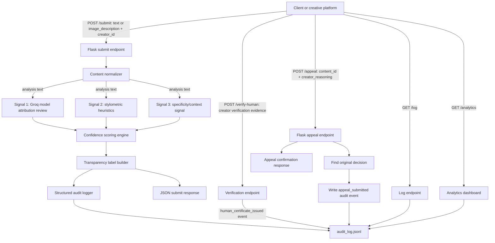

# Provenance Guard

Provenance Guard is a Flask API for classifying submitted creative content as `likely_ai`, `likely_human`, or `uncertain`. It supports plain text and image-description submissions, uses a three-signal ensemble, combines the signals into a confidence score, returns a reader-facing transparency label, rate-limits submissions, stores structured audit-log events, and allows creators to appeal a classification.

The goal is not perfect AI detection. The goal is a cautious provenance workflow: show uncertainty when evidence is mixed, avoid accusing creators, preserve the evidence behind every decision, and provide an appeal path when the system may be wrong.

## Submission Checklist Coverage

| Requirement | Where it is covered |
| --- | --- |
| Flask API with `POST /submit` | `app.py`, "API Endpoints" section |
| JSON request with `text` and `creator_id` | `POST /submit` request body |
| Three-signal ensemble detection | "Detection Signals" section |
| Confidence scoring with uncertainty | "Confidence Scoring" section |
| Three transparency label variants | "Transparency Labels" section |
| `POST /appeal` workflow | "Appeals Workflow" section |
| Structured audit log | `audit_log.jsonl`, "Audit Log" section |
| `GET /log` endpoint | "API Endpoints" and "Audit Log" sections |
| Rate limiting with Flask-Limiter | "Rate Limiting" section |
| README evidence for testing | "Verification Evidence" section |
| Spec reflection | "Spec Reflection" section |
| Stretch feature: ensemble detection | "Detection Signals" and "Confidence Scoring" sections |
| Stretch feature: provenance certificate | "Provenance Certificate" section |
| Stretch feature: analytics dashboard | "Analytics Dashboard" section |
| Stretch feature: multi-modal support | "Multi-Modal Support" section |

## Architecture



Submission flow:

1. The client sends either plain text or an image description to `POST /submit`, along with `creator_id`.
2. Flask validates the request, normalizes supported content into analysis text, and creates a unique `content_id`.
3. The Groq signal reviews the normalized analysis text semantically and returns an AI-likelihood score.
4. The stylometric signal computes deterministic structural metrics and returns a second AI-likelihood score.
5. The specificity/context signal checks the normalized analysis text for concrete lived details versus abstract generic language.
6. The scoring function combines all three signals into a `confidence` value and attribution result.
7. The label builder maps that result to one of three transparency labels.
8. The decision is written to `audit_log.jsonl`.
9. The API returns `content_id`, `attribution`, `confidence`, `label`, and individual signal details.

Appeal flow:

1. The creator submits `content_id` and `creator_reasoning` to `POST /appeal`.
2. The API finds the original classification event.
3. The appeal is logged with its own `appeal_id`.
4. The content status is represented as `under_review` in the appeal log event.
5. The API returns a confirmation response.

Verification flow:

1. A platform moderator or trusted process submits `creator_id`, `verification_method`, and `evidence_summary` to `POST /verify-human`.
2. The API issues an active `verified_human` credential for that creator.
3. Future submissions from the creator include a separate `Verified human creator` badge in the display payload.

Analytics flow:

1. A reviewer opens `GET /analytics`.
2. The API reads structured events from `audit_log.jsonl`.
3. The dashboard shows detection pattern counts, appeal rate, average confidence, and verified-creator submission count.

## Setup

Tech stack:

| Layer | Tool |
| --- | --- |
| API | Flask |
| Rate limiting | Flask-Limiter |
| LLM signal | Groq `llama-3.3-70b-versatile` |
| Local signal 1 | Pure-Python stylometric heuristics |
| Local signal 2 | Pure-Python specificity/context heuristic |
| Supported content types | `text`, `image_description` |
| Audit storage | JSON Lines |

Install dependencies:

```bash
pip install -r requirements.txt
```

Create a `.env` file with a Groq API key:

```text
GROQ_API_KEY=your_key_here
```

Run the server:

```bash
python app.py
```

The app runs locally at:

```text
http://localhost:5000
```

## API Endpoints

### `GET /`

Health-style smoke check.

Response:

```text
Provenance Guard is running.
```

### `POST /submit`

Submits supported content for classification. The default `content_type` is `text`, so existing text requests still work.

Text request:

```json
{
  "content_type": "text",
  "text": "The sun dipped below the horizon, painting the sky in hues of amber and rose.",
  "creator_id": "test-user-1"
}
```

Image-description request:

```json
{
  "content_type": "image_description",
  "creator_id": "image-user-1",
  "image_description": "A phone photo of a wet neighborhood street at night, with porch railing in the foreground and orange streetlights reflected in the puddles.",
  "image_metadata": {
    "source": "creator_upload",
    "camera_app": "phone_camera",
    "caption_source": "creator_written"
  }
}
```

Response includes at least:

```json
{
  "content_id": "d0e8b671-a9a2-4b4c-85ab-d65880975a66",
  "content_type": "text",
  "content_summary": {
    "content_type": "text",
    "text_character_count": 73
  },
  "attribution": "uncertain",
  "confidence": 0.435,
  "label": "Origin uncertain. Provenance Guard found mixed signals, so this text should not be treated as clearly AI-generated or clearly human-written. Confidence: 44%.",
  "transparency_label": "Origin uncertain. Provenance Guard found mixed signals, so this text should not be treated as clearly AI-generated or clearly human-written. Confidence: 44%.",
  "signals": [
    {
      "name": "groq_model_attribution_review",
      "score": 0.54,
      "summary": "Short explanation from the model signal."
    },
    {
      "name": "stylometric_heuristics",
      "score": 0.027,
      "summary": "Structural patterns show varied rhythm, vocabulary, or punctuation."
    },
    {
      "name": "specificity_context_signal",
      "score": 0.65,
      "summary": "Concrete-context evidence is mixed."
    }
  ]
}
```

Test command:

```bash
curl -s -X POST http://localhost:5000/submit \
  -H "Content-Type: application/json" \
  -d '{"text": "The sun dipped below the horizon, painting the sky in hues of amber and rose. I sat on the porch, coffee in hand, watching the neighborhood slowly go quiet.", "creator_id": "test-user-1"}' \
  | python -m json.tool
```

### `POST /appeal`

Submits creator reasoning for a disputed classification.

Request:

```json
{
  "content_id": "d0e8b671-a9a2-4b4c-85ab-d65880975a66",
  "creator_reasoning": "I wrote this myself from personal experience. I am a non-native English speaker and my writing style may appear more formal than typical."
}
```

Response:

```json
{
  "appeal_id": "7ee80dfc-d1dd-4993-9d12-466036f44951",
  "content_id": "d0e8b671-a9a2-4b4c-85ab-d65880975a66",
  "status": "under_review",
  "message": "Appeal received. The original classification is now under review.",
  "created_at": "2026-06-28T06:26:50.383441Z"
}
```

Test command:

```bash
curl -s -X POST http://localhost:5000/appeal \
  -H "Content-Type: application/json" \
  -d '{"content_id": "PASTE-CONTENT-ID-HERE", "creator_reasoning": "I wrote this myself from personal experience. I am a non-native English speaker and my writing style may appear more formal than typical."}' \
  | python -m json.tool
```

### `POST /verify-human`

Issues a `verified_human` credential after an additional creator verification step.

Request:

```json
{
  "creator_id": "verified-demo-1",
  "verification_method": "manual_review_live_writing_sample",
  "evidence_summary": "Moderator reviewed drafting history and a live writing sample."
}
```

Response:

```json
{
  "message": "Verified human credential issued.",
  "certificate": {
    "credential_id": "f8064e6a-ef0a-4b9a-9454-80616f68f473",
    "credential_type": "verified_human",
    "creator_id": "verified-demo-1",
    "status": "active",
    "issued_at": "2026-06-28T07:02:36.651811Z",
    "expires_at": "2026-09-26T07:02:36.651811Z",
    "verification_method": "manual_review_live_writing_sample",
    "display_text": "Verified human creator"
  }
}
```

### `GET /log`

Returns recent audit-log entries.

Response shape:

```json
{
  "entries": [
    {
      "event_type": "attribution_decision",
      "content_id": "d0e8b671-a9a2-4b4c-85ab-d65880975a66",
      "timestamp": "2026-06-28T06:26:50.357636Z",
      "attribution": "likely_ai",
      "confidence": 0.867,
      "llm_score": 0.92,
      "stylometric_score": 0.787,
      "specificity_context_score": 1.0,
      "status": "classified",
      "appeal_filed": false
    }
  ]
}
```

Test command:

```bash
curl -s http://localhost:5000/log | python -m json.tool
```

### `GET /analytics`

Returns a simple HTML dashboard generated from `audit_log.jsonl`.

Dashboard metrics:

- Detection pattern counts by `likely_ai`, `likely_human`, and `uncertain`
- Appeal rate
- Average confidence
- Verified creator submissions

### `GET /analytics.json`

Returns the same dashboard data as JSON for testing.

Example response:

```json
{
  "decision_count": 42,
  "appeal_count": 6,
  "appeal_rate": 0.143,
  "appeal_rate_percent": 14.3,
  "average_confidence": 0.533,
  "detection_patterns": {
    "likely_ai": 12,
    "likely_human": 7,
    "uncertain": 23
  },
  "verified_creator_decisions": 2
}
```

## Detection Signals

Each signal returns a score from `0.0` to `1.0`, where higher means more AI-like. A single signal is not enough to make the final decision because each signal can be fooled in different ways. The stretch ensemble uses three distinct signals for every classification.

### Signal 1: `groq_model_attribution_review`

This signal sends the submitted text to Groq using `llama-3.3-70b-versatile` and asks for a structured JSON assessment:

```json
{
  "score": 0.0,
  "summary": "one short sentence"
}
```

Why this signal is useful:

- It can evaluate high-level writing behavior that simple counts cannot capture.
- It can notice generic development, overly balanced structure, low lived specificity, smooth but formulaic transitions, and lack of concrete authorial context.
- It works as a semantic and stylistic review rather than just a mechanical text metric.

Why this signal is risky:

- It cannot prove authorship.
- It may over-flag polished human writing, classroom essays, marketing copy, or formal non-native English writing.
- It may under-flag AI text that has been heavily edited or prompted to include personal detail.
- Its behavior can shift with model changes, prompt wording, and API availability.

### Signal 2: `stylometric_heuristics`

This signal is implemented locally in Python. It computes structural features from the text and combines them into one AI-likelihood score.

Current metrics:

| Metric | What it measures | Why it matters |
| --- | --- | --- |
| Sentence length variance | Whether sentence lengths are varied or unusually even | Human writing often has uneven rhythm; generated explanatory prose can be smoother and more regular. |
| Type-token ratio | Unique words divided by total words | Very repetitive or generic wording can lower vocabulary diversity. |
| Formulaic phrase density | Presence of phrases like "it is important to note" or "paradigm shift" | Generic transition language can be a weak sign of AI-like or template-like writing. |

Why this signal is useful:

- It is deterministic and does not depend on an external API.
- It gives inspectable metrics that can be logged and explained.
- It is independent from the Groq signal because it measures structure rather than semantic judgment.

Why this signal is risky:

- It does not understand meaning, intent, genre, or author identity.
- Short texts do not provide enough evidence, so the implementation returns a neutral score for very short submissions.
- Poems, dialogue, templates, classroom writing, and intentionally minimalist writing can look unusual to simple metrics.

### Signal 3: `specificity_context_signal`

This stretch signal is also implemented locally in Python. It measures whether a passage contains concrete lived-context markers or mostly abstract, generic language.

Current metrics:

| Metric | What it measures | Why it matters |
| --- | --- | --- |
| First-person markers | Words such as `I`, `my`, `we`, and `our` | Personal context can be a weak sign of human-authored, situated writing. |
| Context and sensory words | Concrete words such as `porch`, `coffee`, `downtown`, `salty`, or `quiet` | Specific physical or sensory details often make writing feel less generic. |
| Numeric tokens | Dates, counts, or other numbers | Concrete quantities can add situated detail, though they are not proof of authorship. |
| Abstract generic terms | Words such as `society`, `stakeholders`, `deployment`, and `implications` | Abstract, broadly applicable language can be a weak sign of AI-like or template-like writing. |

Why this signal is useful:

- It adds a third independent deterministic view of the text.
- It looks at specificity and context rather than sentence rhythm alone.
- It gives audit-log metrics that help explain why a generic paragraph scored higher.

Why this signal is risky:

- It can over-favor diary-like first-person writing.
- It can under-favor formal human writing that intentionally avoids personal detail.
- It cannot know whether a personal detail is real or fabricated.

### Why These Three Signals Together

The three signals are intentionally different:

- Groq is holistic and semantic.
- Stylometrics are structural and statistical.
- Specificity/context is deterministic and looks for concrete situated details versus abstract generic language.

That gives the system three ways to look at the same text. If the ensemble agrees strongly, the system has more reason to return a high-confidence label. If the signals disagree, the scoring function moves the result toward `uncertain`.

For a real deployment, I would add more signals only if they measure genuinely different evidence. Useful additions could include authorship-history comparison for consenting creators, draft-history metadata, platform-specific abuse patterns, or a reviewer feedback loop. I would not simply ask several LLMs the same question and call that independent evidence.

## Confidence Scoring

The scoring system uses a calibrated AI-likelihood score, not a proof of authorship.

Each signal produces:

```text
0.0 = strongly human-like evidence
0.5 = unclear or neutral evidence
1.0 = strongly AI-like evidence
```

The current weighted formula is:

```text
weighted_score =
    (groq_score * 0.50)
  + (stylometric_score * 0.30)
  + (specificity_context_score * 0.20)

disagreement = max(signal_scores) - min(signal_scores)

if disagreement >= 0.35:
    combined_ai_score = weighted_score pulled 0.10 toward 0.50
else:
    combined_ai_score = weighted_score
```

Documented ensemble weights:

| Signal | Weight | Reason |
| --- | --- | --- |
| `groq_model_attribution_review` | `0.50` | The model reviews meaning and style holistically. |
| `stylometric_heuristics` | `0.30` | The heuristics provide deterministic structural evidence. |
| `specificity_context_signal` | `0.20` | The heuristic adds concrete-context evidence without overpowering the other signals. |

Why Groq receives the largest weight:

- It can reason about semantic coherence, specificity, and style in a way the simple metrics cannot.
- It is better at recognizing polished but meaningful human writing than a pure count-based system.

Why the deterministic signals still matter:

- They are deterministic and inspectable.
- They keep the system from depending entirely on one model's judgment.
- Stylometrics can catch mechanical uniformity that a holistic model may summarize too softly.
- Specificity/context can catch generic abstraction or concrete detail that is useful to log explicitly.

Why disagreement is pulled toward uncertainty:

- False positives are especially harmful in a writing platform.
- If one signal says "strongly AI-like" and the other says "human-like," the system should not pretend it has high confidence.
- Pulling mixed evidence toward `0.5` makes the label more honest.

Thresholds:

| Combined AI score | Attribution | Label family |
| --- | --- | --- |
| `>= 0.80` | `likely_ai` | High-confidence AI |
| `<= 0.30` | `likely_human` | High-confidence human |
| `> 0.30` and `< 0.80` | `uncertain` | Uncertain |

This is intentionally conservative. A score of `0.51` is not treated as "probably AI"; it is treated as uncertain. A score must reach `0.80` before the system returns `likely_ai`.

Two actual ensemble test submissions show that the scoring changes meaningfully across different inputs:

| Example | Groq score | Stylometric score | Specificity/context score | Combined confidence | Attribution | Why it matters |
| --- | --- | --- | --- | --- | --- | --- |
| Polished AI-like paragraph about AI ethics and responsible deployment | `0.88` | `0.787` | `1.000` | `0.876` | `likely_ai` | All three signals were high, so the combined score crossed the `0.80` threshold. |
| Borderline mixed paragraph about policy, markets, and ordinary-life incentives | `0.54` | `0.027` | `0.650` | `0.500` | `uncertain` | The signals disagreed strongly, so the result was pulled toward the uncertainty band instead of forcing a high-confidence label. |

These two examples are important because they show the confidence value is not constant. The same scoring function can produce a high-confidence result when the ensemble aligns and a lower-confidence uncertain result when the evidence is mixed.

For a real deployment, I would calibrate these thresholds against labeled validation data from the actual platform. I would also measure false positive rates across genres, language backgrounds, and writing styles. If the platform served vulnerable creators, I would raise the `likely_ai` threshold or require human review before public labels appear.

## False Positive Risk

A false positive happens when a human creator submits original writing and the system labels it `likely_ai`. This is the most important harm case for this project because the label could affect how readers judge the creator's honesty or effort.

Example scenario:

1. A human creator submits a polished essay or formal personal reflection.
2. The Groq signal may flag smooth structure, formal transitions, and limited personal detail as AI-like.
3. The stylometric signal may also flag even sentence lengths or formulaic phrasing.
4. The specificity/context signal may flag the same piece if it is abstract and avoids personal or sensory detail.
5. If the ensemble is high enough, the system may return `likely_ai`.
6. The transparency label still says "Likely" and describes writing patterns rather than accusing the creator.
7. The audit log preserves all signal scores and summaries so the decision can be reviewed.
8. The creator can submit an appeal explaining their drafting context or writing style.

This risk is why the scoring thresholds are conservative. Mixed evidence stays `uncertain`, and high-confidence AI requires a combined score of at least `0.80`. In production, I would monitor appeal outcomes and false-positive rates by writing genre and creator context, then adjust thresholds if the system over-flags real human work.

## Transparency Labels

The submission endpoint returns one of three label variants. The wording describes evidence without accusing the creator.

| Attribution | Label text |
| --- | --- |
| `likely_ai` | `Likely AI-generated. Provenance Guard found strong signs of AI-generated writing patterns. Confidence: {confidence_percent}%.` |
| `likely_human` | `Likely human-written. Provenance Guard found strong signs of human writing patterns. Confidence: {confidence_percent}%.` |
| `uncertain` | `Origin uncertain. Provenance Guard found mixed signals, so this text should not be treated as clearly AI-generated or clearly human-written. Confidence: {confidence_percent}%.` |

Typed description of each displayed variant:

- High-confidence AI: `"Likely AI-generated. Provenance Guard found strong signs of AI-generated writing patterns. Confidence: {confidence_percent}%."`
- High-confidence human: `"Likely human-written. Provenance Guard found strong signs of human writing patterns. Confidence: {confidence_percent}%."`
- Uncertain: `"Origin uncertain. Provenance Guard found mixed signals, so this text should not be treated as clearly AI-generated or clearly human-written. Confidence: {confidence_percent}%."`

For `likely_human`, the displayed confidence is based on `(1 - combined_ai_score)` because a lower AI-likelihood score is stronger human-like evidence. For `likely_ai` and `uncertain`, the displayed percentage uses the combined AI score.

## Appeals Workflow

Creators can contest a classification with `POST /appeal`.

The endpoint:

1. Accepts `content_id` and `creator_reasoning`.
2. Finds the original classification decision in the audit log.
3. Creates an `appeal_id`.
4. Logs the appeal with `status: "under_review"`.
5. Preserves the original attribution, confidence, and signal scores.
6. Returns a confirmation response.

The appeal does not automatically reclassify the text. That is intentional: the first version creates a review trail, not an automated reversal system.

For a real deployment, appeals would need authentication, authorization, reviewer assignment, status transitions such as `reviewed` or `overturned`, and a durable database table instead of only JSON Lines.

## Provenance Certificate

The provenance certificate stretch feature adds a `verified_human` credential that a creator can earn through an additional verification step.

Verification requirements:

| Field | Purpose |
| --- | --- |
| `creator_id` | Identifies the creator who earns the credential. |
| `verification_method` | Records how the platform verified the creator, such as `manual_review_live_writing_sample`. |
| `evidence_summary` | Short moderator-facing note explaining what evidence was reviewed. |

The local implementation issues an active credential for 90 days and stores it as a structured `human_certificate_issued` audit event.

Display text:

```text
Verified human creator
```

How it appears on submitted content:

```json
{
  "transparency_label": "Likely AI-generated. Provenance Guard found strong signs of AI-generated writing patterns. Confidence: 88%.",
  "provenance_badge": "Verified human creator"
}
```

The certificate is intentionally separate from the AI-detection result. It does not change `attribution`, `confidence`, signal scores, or the transparency label. A verified creator can still receive `likely_ai`, `likely_human`, or `uncertain`; the badge only says the platform has separately verified the creator through an added process.

Verified local certificate test:

| Step | Result |
| --- | --- |
| `POST /verify-human` for `verified-demo-1` | Returned `201` and issued credential `f8064e6a-ef0a-4b9a-9454-80616f68f473`. |
| `POST /submit` as `verified-demo-1` | Returned `provenance_certificate` and `display.provenance_badge: "Verified human creator"`. |
| Classification boundary check | The same response still returned `attribution: "likely_ai"` and `confidence: 0.876`, proving the certificate did not override detection. |

## Analytics Dashboard

The analytics dashboard stretch feature adds a read-only `GET /analytics` view and a test-friendly `GET /analytics.json` endpoint. Both are generated from `audit_log.jsonl`.

Metrics shown:

| Metric | Calculation | Current verified value |
| --- | --- | --- |
| Detection patterns | Count attribution decisions grouped by `likely_ai`, `likely_human`, and `uncertain`. | `likely_ai: 12`, `likely_human: 7`, `uncertain: 23` |
| Appeal rate | `appeal_submitted` events divided by attribution decisions. | `6 / 42 = 14.3%` |
| Average confidence | Mean `confidence` across attribution decisions. | `0.533` |
| Verified creator submissions | Count attribution decisions where `creator_verified_human` is `true`. | `2` |

The extra metric I chose is average confidence because it quickly shows whether the classifier is usually making strong decisions or staying near the uncertainty band. In this local log, `0.533` suggests many decisions are closer to uncertainty than to high-confidence AI or high-confidence human.

Verification:

```text
GET /analytics.json -> 200
GET /analytics -> 200
```

The HTML dashboard includes the text `Detection Patterns`, `Appeal rate`, and `Average confidence`.

## Multi-Modal Support

The multi-modal support stretch feature extends `POST /submit` beyond plain text by adding a second content type: `image_description`.

Supported content types:

| Content type | Required fields | Optional fields | How it is analyzed |
| --- | --- | --- | --- |
| `text` | `text`, `creator_id` | `content_type: "text"` | The text is analyzed directly by the three-signal ensemble. |
| `image_description` | `content_type: "image_description"`, `image_description`, `creator_id` | `image_metadata` object | The description and metadata are normalized into analysis text, then analyzed by the same three-signal ensemble. |

Example image-description submission:

```json
{
  "content_type": "image_description",
  "creator_id": "image-user-1",
  "image_description": "A phone photo of a wet neighborhood street at night, with porch railing in the foreground and orange streetlights reflected in the puddles.",
  "image_metadata": {
    "source": "creator_upload",
    "camera_app": "phone_camera",
    "caption_source": "creator_written"
  }
}
```

Example response fields:

```json
{
  "content_type": "image_description",
  "content_summary": {
    "content_type": "image_description",
    "description_character_count": 139,
    "metadata_fields": [
      "camera_app",
      "caption_source",
      "source"
    ]
  }
}
```

This implementation does not inspect raw image pixels. It supports image-related provenance by analyzing a creator-provided or platform-provided description plus structured metadata. That keeps the image workflow honest: the detector is judging the description and metadata text, not claiming visual-forensics capability.

Verified local multi-modal test:

| Step | Result |
| --- | --- |
| Text submission without explicit `content_type` | Returned `200` with `content_type: "text"`. |
| Image-description submission | Returned `200` with `content_type: "image_description"` and metadata fields in `content_summary`. |
| Missing `image_description` for image content | Returned `400` with a clear validation error. |

## Rate Limiting

`POST /submit` is protected with Flask-Limiter:

```python
limiter = Limiter(
    get_remote_address,
    app=app,
    default_limits=[],
    storage_uri="memory://",
)
```

Route limit:

```python
@limiter.limit("10 per minute;100 per day")
```

Chosen limits:

- `10 per minute` per client IP
- `100 per day` per client IP

Reasoning:

- A normal writer may submit a draft, revise it, retry after validation feedback, or test a few pieces in a short session.
- Ten submissions per minute supports that interactive workflow.
- A script flooding the endpoint would hit the limit quickly.
- The daily cap limits one client from burning through classifier calls or filling the audit log over a longer period.

For a real deployment, IP-based limits would not be enough. I would add authenticated user or API-key limits, separate limits by endpoint, persistent limiter storage such as Redis, and monitoring for unusually high appeal or submission rates.

Rate-limit verification produced the expected status codes for 12 rapid submissions:

```text
200
200
200
200
200
200
200
200
200
200
429
429
```

## Audit Log

The audit log is stored as JSON Lines in:

```text
audit_log.jsonl
```

Each line is one structured JSON object. This is easier to inspect than console output and still simple enough for a local project.

Classification events include:

- `event_id`
- `event_type: "attribution_decision"`
- `timestamp`
- `content_id`
- `content_type`
- `content_summary`
- `creator_id`
- `attribution`
- `confidence`
- `llm_score`
- `stylometric_score`
- `specificity_context_score`
- `signal_scores`
- `signal_summaries`
- `signal_weights`
- `transparency_label`
- `provenance_certificate`
- `creator_verified_human`
- `display`
- `appeal_filed`
- `status: "classified"`

Appeal events include:

- `event_id`
- `event_type: "appeal_submitted"`
- `appeal_id`
- `content_id`
- `creator_id`
- `appeal_reasoning`
- `original_attribution`
- `original_confidence`
- `original_signal_scores`
- `appeal_filed: true`
- `status: "under_review"`
- `timestamp`

Certificate events include:

- `event_id`
- `event_type: "human_certificate_issued"`
- `credential_id`
- `credential_type: "verified_human"`
- `creator_id`
- `verification_method`
- `evidence_summary`
- `issued_at`
- `expires_at`
- `display_text`
- `status: "active"`

Verified local ensemble audit-log entries were generated through the Flask routes on 2026-06-28:

| Event type | Content ID | Required audit fields present |
| --- | --- | --- |
| `attribution_decision` | `d92040bf-f575-4422-8537-1b644da95689` | `timestamp`, `content_id`, `attribution`, `confidence`, `llm_score`, `stylometric_score`, `specificity_context_score`, `signal_scores`, `signal_weights`, `appeal_filed` |
| `attribution_decision` | `d70c9b6c-f60c-4fb5-9848-082b1cd59e0c` | `timestamp`, `content_id`, `attribution`, `confidence`, `llm_score`, `stylometric_score`, `specificity_context_score`, `signal_scores`, `signal_weights`, `appeal_filed` |
| `attribution_decision` | `6649c892-71af-4609-aaae-bb0fcdd2c0d4` | `timestamp`, `content_id`, `attribution`, `confidence`, `llm_score`, `stylometric_score`, `specificity_context_score`, `signal_scores`, `signal_weights`, `appeal_filed` |
| `appeal_submitted` | `d92040bf-f575-4422-8537-1b644da95689` | `timestamp`, `content_id`, `status`, `appeal_filed`, `appeal_reasoning`, `original_attribution`, `original_confidence`, `original_signal_scores` with all three signals |
| `human_certificate_issued` | `verified-demo-1` | `timestamp`, `credential_id`, `credential_type`, `creator_id`, `verification_method`, `evidence_summary`, `issued_at`, `expires_at`, `display_text`, `status` |

## Verification Evidence

The following checks were run locally:

| Check | Result |
| --- | --- |
| Flask app import | Passed with `import app` |
| Rate limit | First 10 rapid `/submit` requests returned `200`; next 2 returned `429` |
| Audit log structure | Latest generated entries contained all required classification and appeal fields, including three individual signal scores |
| Appeal workflow | `POST /appeal` returned `status: "under_review"` and wrote an `appeal_submitted` event |
| Provenance certificate | `POST /verify-human` returned `201`; the next `/submit` for that creator displayed `Verified human creator` without changing attribution |
| Analytics dashboard | `GET /analytics.json` returned `200` with detection patterns, appeal rate, and average confidence; `GET /analytics` returned `200` with the HTML dashboard |
| Multi-modal support | Text and `image_description` submissions returned `200`; invalid image-description payload returned `400` |

Example scoring outcomes from controlled tests:

| Input type | Expected behavior | Observed behavior |
| --- | --- | --- |
| Polished AI-like paragraph | Higher AI-likelihood | Returned `likely_ai` when the ensemble scores were high |
| Casual personal paragraph | Lower AI-likelihood | Returned `likely_human` when the ensemble scores were low |
| Formal human writing | Borderline | Returned `uncertain` when evidence was mixed |
| Lightly edited AI-style writing | Borderline | Returned `uncertain` or mid-range confidence depending on signal agreement |

## Limitations and Production Changes

This is a local project implementation, so several choices are intentionally simple.

Important limitations:

- JSON Lines is fine for a demo, but a real system should use a database.
- `memory://` rate-limit storage resets when the server restarts.
- IP-based rate limiting is weak behind proxies or shared networks.
- The Groq signal is a judgment about writing patterns, not proof of authorship.
- Stylometric heuristics are simple and genre-sensitive.
- The specificity/context signal treats concrete personal detail as human-like evidence, but AI can fabricate personal detail and some real human writing is intentionally abstract.
- Poems with repeated lines or intentionally simple vocabulary could be misclassified because the stylometric signal may treat repetition, low type-token ratio, and short line structure as AI-like uniformity, even when those choices are deliberate artistic devices.
- Dialogue-heavy fiction could be misclassified because fragments, repeated phrases, and unusual punctuation can distort sentence-length variance and vocabulary metrics. The stylometric signal does not understand that dialogue rhythm is supposed to be irregular.
- Polished classroom essays or formal writing by non-native English speakers could be over-flagged because the Groq signal looks for smooth structure, generic transitions, and low personal specificity. Those traits can appear in human writing that follows school or professional conventions.
- Very short posts are weak evidence because sentence-length variance and vocabulary diversity are unstable when there are only a few words or sentences. The app handles this partly by returning a neutral stylometric score for short text, but the final result may still be less informative than it looks.
- The app does not authenticate `/log`, but a real system would need access control.
- The appeal workflow records review status but does not include a reviewer UI or final moderation decision.

Changes I would make before deploying for real:

- Store submissions, decisions, and appeals in PostgreSQL or SQLite with indexes.
- Use Redis-backed Flask-Limiter storage.
- Require authentication for `/submit`, `/appeal`, and `/log`.
- Add user-level and API-key-level rate limits.
- Calibrate signal weights and thresholds on platform-specific validation data.
- Add human review tools for appeals.
- Track appeal outcomes to measure false positives and update thresholds.
- Consider returning a `signal_unavailable` error if a required signal fails, rather than using a neutral fallback, depending on product requirements.

## Spec Reflection

One way the spec helped: `planning.md` forced the implementation to keep uncertainty visible instead of turning the classifier into a binary AI-or-human tool. The planned thresholds, disagreement adjustment, and transparency label wording gave clear checks for the code: mixed scores should stay `uncertain`, high-confidence AI should require stronger evidence, and labels should describe writing-pattern evidence rather than accuse a creator.

One way implementation diverged from the spec: `api_contract.md` originally describes `POST /submit` as `201 Created` and treats a failed required signal as a `502 signal_unavailable` error. During local implementation, `/submit` was changed to return `200` so the rate-limit verification output matched the project test instructions, and Groq failures fall back to a neutral signal so the rest of the local workflow can still be tested without network/API access. In a production version, I would revisit that divergence and likely return an explicit signal failure instead of silently using a neutral fallback.

## AI Usage

AI assistance was used as a coding and documentation collaborator, but the implementation was reviewed and revised against `planning.md`, `api_contract.md`, and the project checklist before being kept.

| Instance | What the AI was directed to do | What it produced | What was revised or overridden |
| --- | --- | --- | --- |
| Flask app skeleton and first signal | Generate a Flask app with `POST /submit`, JSON validation, a unique `content_id`, and a Groq-based signal function returning a structured score and summary. | `app.py` with the Flask app, `/submit`, `groq_model_attribution_review`, request parsing, and JSON responses. | The output was checked against the API contract. The route was revised to require both `text` and `creator_id`, return the fields needed by later appeals, and fall back to a neutral Groq signal during local network/API failures so development could continue. |
| Second signal and confidence scoring | Generate a standalone stylometric signal and combine it with the Groq score according to the planning thresholds. | `stylometric_heuristics`, `combine_signals`, and `build_transparency_label`, including individual signal scores and summaries. | The scoring logic was reviewed against the planned thresholds: `>= 0.80` for `likely_ai`, `<= 0.30` for `likely_human`, and the middle range for `uncertain`. The disagreement adjustment was kept because it matched the project goal of pushing mixed evidence toward uncertainty. |
| Appeals, audit log, and rate limiting | Add the appeal route, structured audit logging, `/log`, and Flask-Limiter configuration. | `POST /appeal`, JSON Lines audit entries, `GET /log`, and `@limiter.limit("10 per minute;100 per day")` on `/submit`. | The audit log was revised to include `event_type`, individual signal scores, `appeal_filed`, and `appeal_reasoning` so the log clearly shows the original decision and later appeal. The rate-limit documentation was updated with actual `200` and `429` test output. |
| README documentation | Write the final README sections required by the submission checklist, including signal reasoning, confidence scoring, label variants, limitations, and production changes. | A checklist-style README with setup, endpoints, architecture, detection rationale, scoring examples, labels, audit evidence, limitations, and file map. | The limitations section was strengthened to name specific content types the system may get wrong, such as poems, dialogue-heavy fiction, polished classroom essays, and very short posts, with each limitation tied to a signal property rather than a generic caveat. |
| Ensemble detection stretch | Add a third or later detection signal and document a revised weighting approach before coding it. | `specificity_context_signal`, revised `SIGNAL_WEIGHTS`, three-signal `/submit` responses, and audit-log entries with `specificity_context_score`. | The first version still had two-signal wording in the README and planning doc, so those sections were revised to describe the three-signal ensemble and the 50/30/20 weighting. |
| Provenance certificate stretch | Design and implement a verified-human credential that a creator earns through an additional verification step. | `POST /verify-human`, `human_certificate_issued` audit events, `provenance_certificate` response fields, and `display.provenance_badge`. | The credential was kept separate from `attribution` and `confidence`; a verified creator can still receive a `likely_ai` label, proving the badge does not override detection evidence. |
| Analytics dashboard stretch | Build a simple view showing detection patterns, appeal rates, and one additional metric. | `analytics_summary`, `GET /analytics`, and `GET /analytics.json`, backed by `audit_log.jsonl`. | The dashboard was kept read-only and transparent about its calculations; average confidence was chosen as the additional metric because it shows whether decisions cluster near uncertainty. |
| Multi-modal support stretch | Extend the pipeline to support a second content type in addition to text. | `normalize_submission_payload`, `content_type: "image_description"`, `image_metadata`, and audit fields for `content_type` and `content_summary`. | The implementation was limited to image descriptions and metadata rather than raw image analysis, so the detector does not overclaim visual-forensics capability. |

## File Map

| File | Purpose |
| --- | --- |
| `app.py` | Flask routes, detection signals, scoring, labels, audit logging, rate limiting |
| `planning.md` | Design spec, architecture diagram, scoring rationale, appeals workflow |
| `api_contract.md` | API contract drafted before implementation |
| `audit_log.jsonl` | Structured local audit log |
| `requirements.txt` | Python dependencies |
