# Provenance Guard Planning

## Project Goal

Provenance Guard is a backend system that creative sharing platforms can plug into to classify submitted text, score confidence in that classification, show a reader-facing transparency label, and handle appeals from creators who believe they were misclassified.

The first implementation will be a Flask API with a multi-signal detection pipeline, Flask-Limiter rate limiting, structured JSON audit logging, and a creator appeal workflow.

## Design Principles From Project Hints

- False positives are more harmful than false negatives on a writing platform. The system should require stronger evidence before labeling work as likely AI-generated than it requires before admitting uncertainty.
- A `0.5` score should mean "the system cannot responsibly lean AI or human from the available evidence." Scoring and labels should be designed around that user meaning, not around whatever number the implementation happens to produce.
- The transparency label is a UX surface. Before finalizing label text, read it as a creator and as a reader: it should communicate evidence and uncertainty without accusing the creator of dishonesty.
- Rate limits must reflect realistic writing-platform behavior and adversarial behavior. A normal creator may submit a few drafts or retries in a minute; an adversary may script rapid repeated submissions to exhaust Groq calls or fill the audit log.
- Perfect AI detection is not a realistic goal. The engineering goal is honest uncertainty, structured evidence, and a working appeal path.
- When an implementation question feels unclear, return to this spec and add the missing design decision before writing code.

## Architecture

This is the reference architecture for code generation throughout the project. In the submission flow, the platform sends raw text to `POST /submit`, the backend runs the Groq semantic signal and the stylometric structural signal, combines their scores into a calibrated confidence value, builds the transparency label, writes the attribution decision to the audit log, and returns the decision payload. In the appeal flow, the creator sends `content_id` and reasoning to `POST /appeal`, the backend updates the content status to `under_review`, records the appeal beside the original decision in the audit log, and returns an appeal confirmation.

```mermaid
flowchart TD
    subgraph Submission_Flow[Submission flow]
        A[Creative platform] -->|POST /submit: raw text + optional metadata| B[Submission endpoint]
        B -->|validated raw text + content_id| C[Signal 1: Groq model attribution review]
        C -->|raw text + Groq signal score + Groq summary| D[Signal 2: stylometric heuristics]
        D -->|Groq score + stylometric score + signal summaries| E[Confidence scoring engine]
        E -->|combined score + attribution + confidence| F[Transparency label builder]
        F -->|label text + decision payload| G[Audit logger]
        G -->|structured attribution_decision event| H[Structured audit log]
        G -->|content_id + attribution + confidence + label text + signals| I[Submission response]
        I -->|JSON response| A
    end

    subgraph Appeal_Flow[Appeal flow]
        J[Creative platform] -->|POST /appeal: content_id + creator_reasoning| K[Appeal endpoint]
        K -->|appeal request + original decision| L[Appeals service]
        L -->|content_id + appeal_id + status under_review| M[Status manager]
        M -->|status update + creator reasoning + original decision| N[Audit logger]
        N -->|structured appeal_submitted event| O[Structured audit log]
        N -->|appeal_id + status under_review + message| P[Appeal response]
        P -->|JSON response| J
    end
```



ASCII version:

```text
Submission flow:

Creative Platform
  -- POST /submit: raw text + optional metadata -->
Submission Endpoint
  -- validated raw text + content_id -->
Signal 1: Groq Model Attribution Review
  -- raw text + Groq signal score + Groq summary -->
Signal 2: Stylometric Heuristics
  -- Groq score + stylometric score + signal summaries -->
Confidence Scoring Engine
  -- combined score + attribution + confidence -->
Transparency Label Builder
  -- label text + decision payload -->
Audit Logger
  -- structured attribution_decision event -->
Structured Audit Log

Audit Logger
  -- content_id + attribution + confidence + label text + signals -->
Submission Response
  -- JSON response -->
Creative Platform

Appeal flow:

Creative Platform
  -- POST /appeal: content_id + creator_reasoning -->
Appeal Endpoint
  -- appeal request + original decision -->
Appeals Service
  -- content_id + appeal_id + status under_review -->
Status Manager
  -- status update + creator reasoning + original decision -->
Audit Logger
  -- structured appeal_submitted event -->
Structured Audit Log

Audit Logger
  -- appeal_id + status under_review + message -->
Appeal Response
  -- JSON response -->
Creative Platform
```

## 1. Detection Signals

The base system uses distinct signals for every classification, and the ensemble stretch feature extends that set to three. The signals are intentionally different: one is semantic and holistic, one is structural and statistical, and the stretch signal is deterministic concrete-context evidence.

| Signal | Tool | What it measures | Output shape | Blind spots |
| --- | --- | --- | --- | --- |
| `groq_model_attribution_review` | Groq with `llama-3.3-70b-versatile` | Whether the text reads as human-written or AI-generated based on semantic and stylistic coherence. It looks for generic development, overly balanced structure, low lived specificity, smooth but formulaic transitions, and lack of concrete authorial context. | JSON object with `score` from `0.0` to `1.0`, where `1.0` means strongly AI-like and `0.0` means strongly human-like, plus a short `summary`. | Cannot prove authorship. May over-flag polished human prose, classroom essays, marketing copy, or conventional writing. May under-flag AI text that was heavily edited or prompted to include personal detail. |
| `stylometric_heuristics` | Pure Python | Structural statistics: sentence length variance, type-token ratio, punctuation density, average sentence complexity, repetition, and paragraph regularity. | JSON object with `score` from `0.0` to `1.0`, where `1.0` means structurally AI-like and `0.0` means structurally human-like, plus metric details and a short `summary`. | Does not understand meaning or intent. Performs poorly on very short submissions, poems, dialogue, templates, highly edited work, and intentionally minimalist writing. |

Signal output example:

```json
[
  {
    "name": "groq_model_attribution_review",
    "score": 0.82,
    "summary": "The text is fluent and coherent but uses generic transitions and few concrete personal details."
  },
  {
    "name": "stylometric_heuristics",
    "score": 0.68,
    "summary": "Sentence lengths and punctuation patterns are more uniform than expected."
  }
]
```

### Combining Signals

Each signal produces an AI-likelihood score from `0.0` to `1.0`. Higher means more AI-like.

Initial weights:

| Signal | Weight | Reason |
| --- | --- | --- |
| `groq_model_attribution_review` | `0.60` | The model captures semantic and stylistic coherence that simple metrics cannot. |
| `stylometric_heuristics` | `0.40` | The heuristics provide independent structural evidence and are deterministic. |

Formula:

```text
weighted_score = (groq_score * 0.60) + (stylometric_score * 0.40)
disagreement = abs(groq_score - stylometric_score)

if disagreement >= 0.35:
    combined_ai_score = weighted_score pulled 0.10 toward 0.50
else:
    combined_ai_score = weighted_score
```

The disagreement adjustment prevents one very strong signal from creating a high-confidence result when the other signal says the opposite. It deliberately moves mixed evidence toward uncertainty.

Example:

```text
groq_score = 0.82
stylometric_score = 0.68
weighted_score = (0.82 * 0.60) + (0.68 * 0.40) = 0.764
disagreement = 0.14
combined_ai_score = 0.764
result = uncertain
display confidence = 76%
```

## 2. Uncertainty Representation

The core calibrated value is `combined_ai_score`, a number from `0.0` to `1.0`.

- `0.0` means the combined evidence is strongly human-like.
- `0.5` means the system cannot responsibly lean AI or human from the available evidence.
- `1.0` means the combined evidence is strongly AI-like.

A score of `0.6` means the system sees some AI-like evidence, but not enough to make a confident AI attribution. To a user, this should read as "uncertain with a slight AI-like lean," not as "the creator probably used AI." It is inside the uncertainty band, so the API should return:

```json
{
  "attribution": "uncertain",
  "confidence": 0.6,
  "transparency_label": "Origin uncertain. Provenance Guard found mixed signals, so this text should not be treated as clearly AI-generated or clearly human-written. Confidence: 60%."
}
```

### Thresholds

| `combined_ai_score` range | Attribution result | Label family |
| --- | --- | --- |
| `0.80` to `1.00` | `likely_ai` | High-confidence AI |
| `0.31` to `0.79` | `uncertain` | Uncertain |
| `0.00` to `0.30` | `likely_human` | High-confidence human |

The thresholds are intentionally asymmetric. Because a false positive can damage a human creator's reputation, `likely_ai` requires stronger evidence (`0.80+`) than a simple majority lean. Borderline and mixed cases should stay `uncertain` so the platform does not overstate what the detector knows.

### Display Confidence

The API field named `confidence` will carry the calibrated score used to choose the label.

For reader-facing label text:

- `likely_ai`: show `combined_ai_score * 100`.
- `likely_human`: show `(1 - combined_ai_score) * 100`, because lower AI-likelihood is stronger human evidence.
- `uncertain`: show `combined_ai_score * 100` as the system's weak AI-likelihood lean, but keep the label text explicitly uncertain.

Examples:

| Signal scores | Combined AI score | Attribution | Label confidence text |
| --- | --- | --- | --- |
| Groq `0.95`, stylometric `0.90` | `0.93` | `likely_ai` | `Confidence: 93%.` |
| Groq `0.22`, stylometric `0.24` | `0.23` | `likely_human` | `Confidence: 77%.` |
| Groq `0.62`, stylometric `0.55` | `0.59` | `uncertain` | `Confidence: 59%.` |
| Groq `0.90`, stylometric `0.25` | pulled toward `0.64` because signals disagree | `uncertain` | `Confidence: 64%.` |

This scoring design is intentionally conservative. High-confidence AI requires the weighted evidence to be strong enough to push the combined score to `0.80` or higher. High-confidence human requires the weighted evidence to push the combined score to `0.30` or lower. A score near `0.5` should be explained as uncertainty, not hidden behind a forced binary label.

## 3. Transparency Label Design

The label must be plain language, cautious, and useful to non-technical readers. It should describe evidence rather than accuse the creator.

Exact label variants:

| Variant | Exact label text |
| --- | --- |
| High-confidence AI | `"Likely AI-generated. Provenance Guard found strong signs of AI-generated writing patterns. Confidence: {confidence_percent}%."` |
| High-confidence human | `"Likely human-written. Provenance Guard found strong signs of human writing patterns. Confidence: {confidence_percent}%."` |
| Uncertain | `"Origin uncertain. Provenance Guard found mixed signals, so this text should not be treated as clearly AI-generated or clearly human-written. Confidence: {confidence_percent}%."` |

The `confidence_percent` value is computed from the calibrated score as described in the previous section.

UX review questions before implementation:

- Would a human creator understand that "Likely AI-generated" is an evidence-based system judgment, not an accusation?
- Would a reader understand that "Origin uncertain" means the platform should not treat the content as clearly AI-written or clearly human-written?
- Does the confidence percentage make the label more meaningful, or does it create false precision? If it feels too precise in testing, round to the nearest whole percent and keep the cautious wording.

## 4. Appeals Workflow

### Who Can Submit an Appeal?

A creator whose submitted content has been classified by Provenance Guard can submit an appeal. In the first version, the host platform is responsible for authenticating that the caller is allowed to appeal the content. Provenance Guard stores the provided `creator_id` if the platform sends one.

### Appeal Endpoint

Endpoint: `POST /appeal`

Request body:

```json
{
  "content_id": "cnt_001",
  "creator_reasoning": "This was drafted from my personal journal and edited manually.",
  "creator_id": "creator_123"
}
```

Required fields:

| Field | Required | Purpose |
| --- | --- | --- |
| `content_id` | Yes | Links the appeal to the original attribution decision. |
| `creator_reasoning` | Yes | Captures why the creator believes the classification is wrong. |
| `creator_id` | No | Lets the host platform connect the appeal to its own user records. |

### System Behavior When an Appeal Is Received

1. Validate that `content_id` exists.
2. Validate that `creator_reasoning` is present and not blank.
3. Create an `appeal_id`.
4. Store the creator's reasoning.
5. Link the appeal to the original decision and its signal scores.
6. Change the content status from `classified` to `under_review`.
7. Write an `appeal_submitted` event to the audit log.
8. Return an appeal response to the platform.

Response body:

```json
{
  "appeal_id": "apl_001",
  "content_id": "cnt_001",
  "status": "under_review",
  "message": "Appeal received. The original classification is now under review.",
  "created_at": "2026-06-27T20:20:00Z"
}
```

### What Gets Logged?

The appeal audit entry includes:

- `event_id`
- `event_type: "appeal_submitted"`
- `appeal_id`
- `content_id`
- `creator_id` if provided
- `creator_reasoning`
- original `attribution`
- original `confidence`
- original signal scores and summaries
- new `status: "under_review"`
- timestamp

### What a Human Reviewer Sees

The first version does not need to implement a reviewer UI, but the data model must support an appeal queue. A human reviewer opening the queue should see:

| Field | Why it matters |
| --- | --- |
| `appeal_id` | Identifies the appeal. |
| `content_id` | Links to the original submitted content. |
| `creator_id` | Shows who submitted the appeal, if supplied by the platform. |
| `submitted_text` or safe excerpt | Lets the reviewer inspect the disputed content. |
| `creator_reasoning` | Shows the creator's explanation. |
| `original_attribution` | Shows whether the disputed result was `likely_ai`, `likely_human`, or `uncertain`. |
| `original_confidence` | Shows how strong the system's decision was. |
| `signal_scores` | Shows the Groq score and stylometric score that led to the decision. |
| `transparency_label` | Shows what readers saw. |
| `status` | Shows that the item is `under_review`. |
| `created_at` | Helps reviewers sort older appeals first. |

## 5. Anticipated Edge Cases

| Edge case | Why the system may handle it poorly | Planned behavior |
| --- | --- | --- |
| A poem with heavy repetition and simple vocabulary | Stylometric heuristics may treat repeated words, short lines, and low type-token ratio as AI-like uniformity even when the repetition is an intentional poetic device. | Keep the result uncertain if Groq does not strongly agree. The audit log should show the stylometric reason so an appeal reviewer can understand the false-positive risk. |
| A classroom essay written by a human in a very polished five-paragraph structure | Groq may see generic transitions and conventional organization as AI-like. Stylometric heuristics may also see balanced paragraphs and sentence regularity. | High-confidence AI still requires strong agreement. The label uses "Likely" instead of "Definitely," and the creator can appeal with drafting context. |
| A short post under 50 words | There may not be enough text for reliable sentence variance, type-token ratio, or punctuation density. Groq also has limited context. | Return `uncertain` or include a low-evidence warning in the signal summaries. Do not return high-confidence AI or high-confidence human from very short text. |
| Dialogue-heavy fiction | Dialogue can use short repeated phrases, fragments, and unusual punctuation. Stylometric metrics may misread this as low complexity or repetitive structure. | Let Groq's semantic review counterbalance the heuristic score. If signals disagree, push toward `uncertain`. |
| AI-generated text heavily edited by a human | The stylometric signal may look human-like after editing, and Groq may see more lived detail than usual. | Allow `likely_human` or `uncertain` depending on scores. The system should not pretend to detect hidden AI involvement when both observable signals are human-like. |

## False Positive Scenario

A false positive happens when a human writer's original work is classified as AI-generated. This is the most important harm case because the label may affect how readers judge the creator's honesty or effort.

Trace:

1. The creator submits polished original text to `POST /submit`.
2. Groq marks the text AI-like because it is smooth, generic, and evenly organized.
3. Stylometric heuristics mark the text AI-like because sentence length variance is low and punctuation density is regular.
4. If the ensemble evidence is strong, the system may return `likely_ai`; if signals are weak or contradictory, the result should move to `uncertain`.
5. The label says "Likely AI-generated," not "definitely AI-generated," and describes writing patterns rather than accusing the creator.
6. The audit log stores the full decision, including all signal scores.
7. The creator submits `POST /appeal` with reasoning and any platform-supported context.
8. The content status becomes `under_review`.
9. The reviewer can inspect the original decision, signal summaries, confidence score, label text, and creator reasoning.

Design decisions from this scenario:

- Mixed signals should produce `uncertain`, even if the combined score leans slightly AI-like.
- High-confidence AI should require both distinct signals to agree strongly.
- Labels must describe evidence, not accuse the creator.
- Appeals are required because confidence is not proof.

## Endpoint Summary

| Endpoint | Purpose |
| --- | --- |
| `POST /submit` | Accept text, run the detection ensemble, return attribution, confidence, signal details, transparency label, and status. |
| `GET /content/{content_id}` | Return the latest classification and review status for one submitted content item. |
| `POST /appeal` | Accept creator reasoning, log the appeal, and update content status to `under_review`. |
| `GET /log` | Return structured audit-log entries for decisions and appeals. |
| `GET /analytics` | Return a simple audit-log-backed dashboard with detection patterns, appeal rate, and average confidence. |
| `GET /health` | Return a minimal service health check. |

## Rate Limiting Plan

Initial limit for `POST /submit`: **10 requests per minute per client IP**.

Reasoning:

- A real creator might submit a piece, revise it, retry after a validation error, or test a few short drafts in quick succession.
- Ten submissions per minute is enough for normal interactive use but low enough to slow accidental loops and scripted abuse.
- An adversary could try to flood the service to consume Groq calls, generate noisy audit logs, or probe the detector with many prompt variations.
- If Groq cost or latency becomes a problem, the limit can be tightened or paired with platform API keys in addition to IP-based limits.
- Appeals should be lower volume than submissions. The first version can keep appeals unmetered for usability, but if abuse appears, add a separate limit such as 5 appeals per hour per creator or platform key.

## AI Tool Plan

This section defines how the planning document will be used when prompting an AI coding tool during implementation. Each milestone should provide only the relevant planning sections plus the architecture diagram, then verify the generated code before building the next layer.

| Milestone | Spec sections to provide to AI tool | Ask the AI tool to generate | Verification before moving on |
| --- | --- | --- | --- |
| M3: Submission endpoint + first signal | `## Architecture` and `## 1. Detection Signals`, focusing on `groq_model_attribution_review`. | Flask app skeleton with `POST /submit`, request validation, placeholder audit logging, and the first signal function that calls Groq `llama-3.3-70b-versatile` and returns a `0.0` to `1.0` score plus summary. | Test the first signal function directly with a few inputs before wiring it fully into the endpoint: clearly AI-like prose, clearly human-like prose, and a borderline polished human sample. Confirm the function returns valid JSON-shaped output with score, summary, and no missing fields. |
| M4: Second signal + confidence scoring | `## Architecture`, `## 1. Detection Signals`, and `## 2. Uncertainty Representation`. | Pure-Python `stylometric_heuristics` function plus confidence scoring logic that combines Groq and stylometric scores using the planned weights, disagreement adjustment, thresholds, and attribution values. | Check that scores vary meaningfully between clearly AI-like and clearly human-like text. Confirm mixed or conflicting signal scores move into `uncertain`, a score around `0.6` maps to `uncertain`, scores `>= 0.80` map to `likely_ai`, and scores `<= 0.30` map to `likely_human`. |
| M5: Production layer | `## Architecture`, `## 3. Transparency Label Design`, `## 4. Appeals Workflow`, `## Endpoint Summary`, and `## Audit Log Requirements`. | Transparency label generation logic, `POST /appeal`, `GET /content/{content_id}`, `GET /log`, status updates, and structured audit-log writes for attribution decisions and appeals. | Test that all three label variants are reachable by controlled scores or fixtures. Submit an appeal and confirm the response includes `appeal_id`, the content status changes to `under_review`, and the audit log contains both the original attribution decision and the `appeal_submitted` event. |

## Stretch Feature Plan

Stretch features must not begin until this section is updated with any extra implementation decisions needed for that feature. Any completed stretch feature must also be documented in `README.md` with what was built and how it works, because the README is the grader-facing record of completed functionality.

| Stretch feature | Planning update required before starting | Implementation idea | README evidence required if completed |
| --- | --- | --- | --- |
| Ensemble detection | Add the third or later detection signal, define what it measures, document its blind spots, and revise the weighting or voting formula. | Add at least one additional independent signal, such as perplexity-style repetition analysis, metadata/context consistency, or another deterministic text metric. Combine 3+ signals using documented weights or a vote-plus-confidence approach. | Document all signals, weights or voting rules, sample outputs, and how the ensemble changes confidence scoring. |
| Provenance certificate | Define the verification step, who can earn the credential, how long it lasts, and how it affects display without overriding detection evidence. | Add a creator verification workflow that issues a `verified_human` credential after an additional review or proof step. Display the credential separately from the AI/human attribution label. | Document the credential requirements, API/status fields, display text, and how verified status appears on content. |
| Analytics dashboard | Define the metrics, data source, and route/view that will expose aggregate patterns. | Build a simple dashboard or JSON-backed view showing detection pattern counts, appeal rate, and one extra metric such as average confidence or false-positive review rate. | Document the dashboard route, metrics shown, and how each metric is calculated. |
| Multi-modal support | Define the second content type, accepted input shape, signal changes, and audit-log fields before implementation. | Extend the submission pipeline beyond text, such as handling image descriptions or structured metadata alongside text. Keep text detection separate from the second content type's analysis. | Document the supported content type, endpoint/request changes, signal behavior, and sample response. |

### Stretch Feature Update: Ensemble Detection

The ensemble implementation adds a third signal named `specificity_context_signal`.

| Signal | Tool | What it measures | Output shape | Blind spots |
| --- | --- | --- | --- | --- |
| `specificity_context_signal` | Pure Python | Concrete lived-context markers versus abstract or generic language. It counts first-person markers, sensory/context words, and numbers as human-like specificity, then compares that with abstract generic terms such as "society," "stakeholders," "deployment," and "implications." | JSON object with `score` from `0.0` to `1.0`, where `1.0` means low-specificity or abstract AI-like evidence and `0.0` means concrete human-like evidence, plus metric details and a short `summary`. | Can over-favor diary-like first-person writing and under-favor formal human writing that intentionally avoids personal detail. It also cannot know whether a personal detail is real or fabricated. |

Revised ensemble weights:

| Signal | Weight | Reason |
| --- | --- | --- |
| `groq_model_attribution_review` | `0.50` | Still the strongest signal because it reviews meaning and style holistically. |
| `stylometric_heuristics` | `0.30` | Keeps deterministic structural evidence in the decision. |
| `specificity_context_signal` | `0.20` | Adds deterministic evidence about concrete context and abstractness without overpowering the existing signals. |

Revised formula:

```text
weighted_score =
    (groq_score * 0.50)
  + (stylometric_score * 0.30)
  + (specificity_context_score * 0.20)

disagreement = max(signal_scores) - min(signal_scores)

if disagreement >= 0.35:
    combined_ai_score = weighted_score pulled 0.10 toward 0.50
else:
    combined_ai_score = weighted_score
```

The same attribution thresholds remain in place: `>= 0.80` for `likely_ai`, `<= 0.30` for `likely_human`, and the middle range for `uncertain`. The third signal changes the evidence mix, not the meaning of the labels.

### Stretch Feature Update: Provenance Certificate

The provenance certificate implementation adds a `verified_human` credential that belongs to a creator, not to one text submission.

Verification step:

1. A platform moderator or trusted verification workflow sends `POST /verify-human`.
2. The request must include `creator_id`, `verification_method`, and `evidence_summary`.
3. The backend issues a `credential_id`, stores a `human_certificate_issued` audit event, and marks the credential `active`.
4. The credential lasts 90 days in this local implementation.
5. Future `POST /submit` responses for that `creator_id` include a separate provenance certificate display object.

Certificate display rule:

```text
Verified human creator
```

This badge is displayed separately from the transparency label. It does not change `attribution`, `confidence`, signal scores, or the transparency label. A verified creator can still receive `likely_ai`, `likely_human`, or `uncertain`; the certificate only says the platform has verified the creator through an additional process.

Why it is separate from detection:

- Detection evaluates the submitted text.
- The certificate evaluates creator verification status.
- Combining them into one label would hide uncertainty and could make the detector appear more certain than it is.

### Stretch Feature Update: Analytics Dashboard

The analytics dashboard implementation adds a read-only `GET /analytics` route backed by the structured audit log.

Metrics shown:

| Metric | Calculation | Why it matters |
| --- | --- | --- |
| Detection patterns | Count `attribution_decision` events grouped by `likely_ai`, `likely_human`, and `uncertain`. | Shows whether the detector is mostly producing confident labels or uncertainty. |
| Appeal rate | `appeal_submitted` events divided by attribution decisions. | Shows how often creators contest classifications. |
| Average confidence | Average `confidence` across attribution decisions. | Gives a quick sense of whether decisions are generally strong or near the uncertainty band. |

The route is intentionally simple and local: it renders an HTML dashboard directly from `audit_log.jsonl`. In production this should become an authenticated dashboard backed by database queries and time-window filters.

### Stretch Feature Update: Multi-Modal Support

The multi-modal support implementation extends `POST /submit` to accept a second content type: `image_description`.

Supported content types:

| Content type | Required fields | Optional fields | Detection behavior |
| --- | --- | --- | --- |
| `text` | `text`, `creator_id` | `content_type: "text"` | Runs the existing three-signal text ensemble on the submitted text. |
| `image_description` | `image_description`, `creator_id`, `content_type: "image_description"` | `image_metadata` object | Converts the image description and metadata into an analysis text string, then runs the existing three-signal ensemble on that textual representation. |

The first multi-modal version does not inspect raw image pixels. It supports image-related provenance by accepting a creator-provided or platform-provided image description plus structured metadata such as camera/app source, caption source, alt-text source, or upload context.

Audit-log additions:

- `content_type`
- `content_summary`

Why this design:

- It extends the API beyond plain text without pretending to perform visual forensics.
- It keeps text detection separate from the second content type's normalization step.
- It records the content type in the audit log so later analytics and review can distinguish text decisions from image-description decisions.

## Audit Log Requirements

Every attribution decision must produce an `attribution_decision` log entry containing:

- `event_id`
- `event_type`
- `content_id`
- timestamp
- raw `combined_ai_score`
- returned `attribution`
- returned `confidence`
- transparency label text
- all signal names
- all signal scores
- all signal summaries
- content status

Every appeal must produce an `appeal_submitted` log entry containing the appeal fields listed in the Appeals Workflow section.

## Implementation Notes

- Use Flask for the API.
- Use Flask-Limiter for rate limiting.
- Use Groq `llama-3.3-70b-versatile` for the LLM-based signal.
- Implement stylometric heuristics in pure Python.
- Use structured JSON as the first audit-log storage format; SQLite can be added later if needed.
- Keep `.env` ignored so API keys and local configuration are not committed.
- If one detection signal fails, return a `signal_unavailable` error instead of silently making a single-signal decision.
